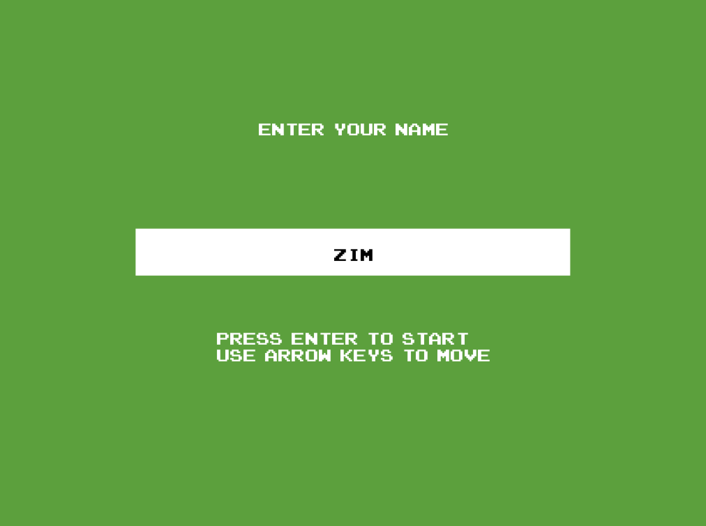
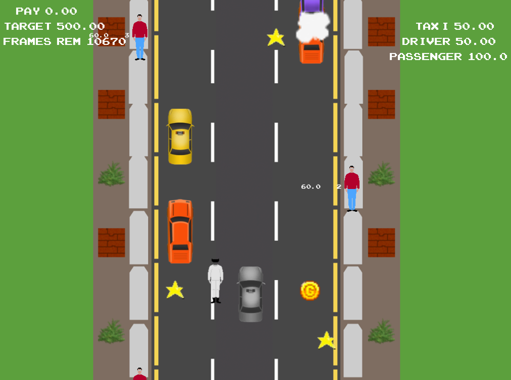
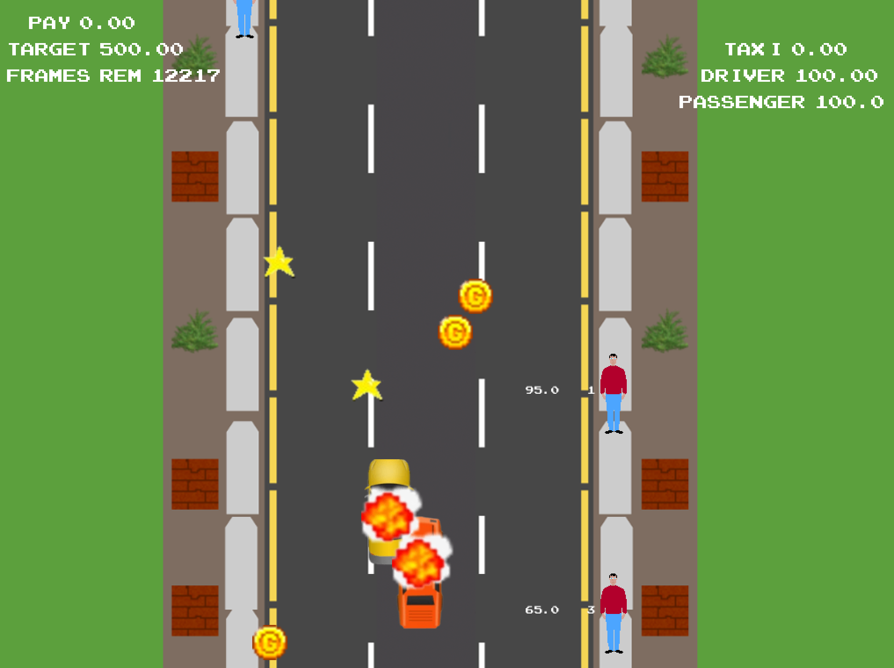
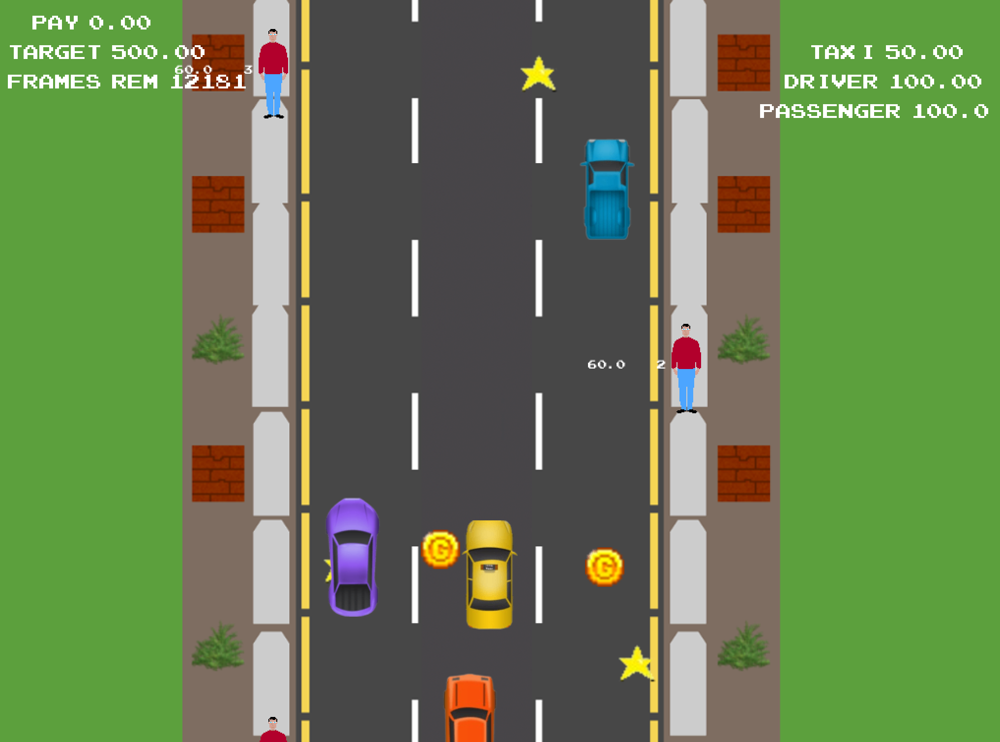
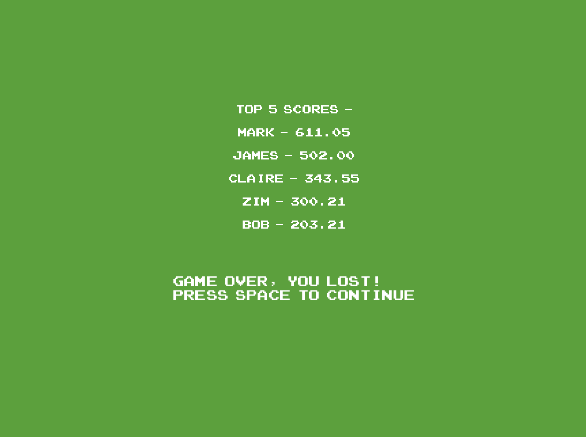

# SWEN20003 ShadowTaxi (Grade: 11/11)
- Code for the main project for UniMelb subject: [Object Oriented Software Development (SWEN20003)](https://handbook.unimelb.edu.au/2024/subjects/swen20003) - Semester 2, 2024.
- Small amount of skeleton code written by subject tutors; implemented by me.
- Assignment specification in the pdf attached.
- Build project using Apache Maven in IntelliJ, and run the ShawdowTaxi.java class in the src folder.
- NOTE: If failing to run on Mac, try using JDK 17 or earlier versions.

## Main tasks
- Develop a taxi simulation game using the [Bagel](https://github.com/eleanor-em/bagel) library.
- Plan class relationships using a UML diagram (pdf attached)
- Demonstrate OOP principles: inheritance, interfaces, generics, design patterns.

## In-game screenshots

